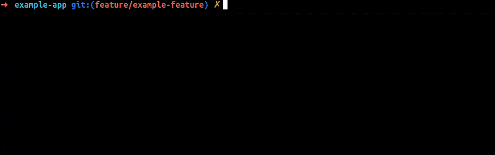

# Conventional Commits

CLI to create [conventional commits](https://www.conventionalcommits.org/).

<div align="center">
  
</div>

## Setup

Install dependencies:
```bash
npm i
```

Build:
```bash
npm run build
```

Install the package globally:
```bash
npm i -g .
```

## Usage

After the setup, execute the following command:
```bash
conventional-commits
```
